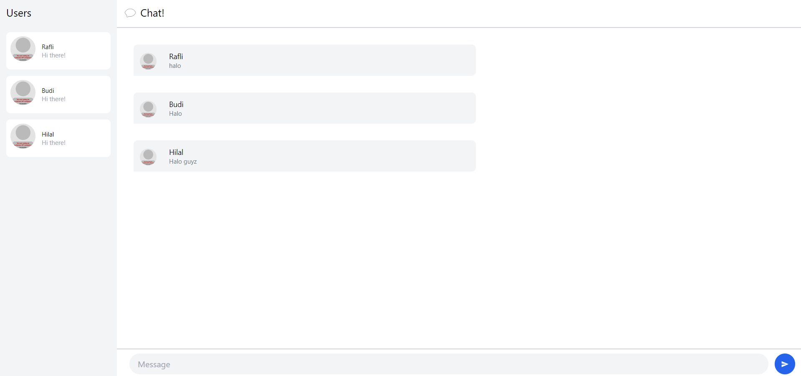
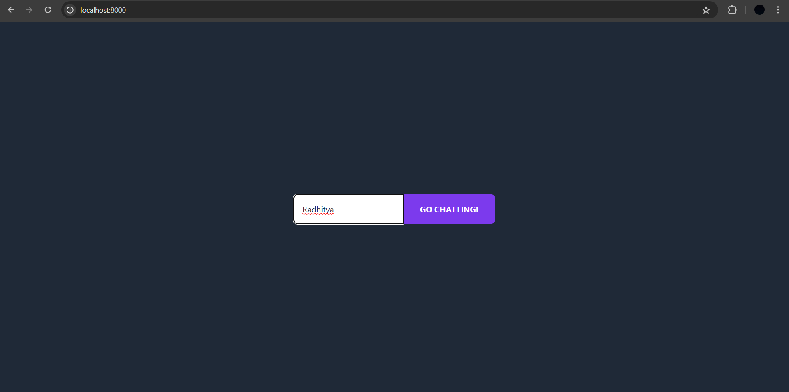
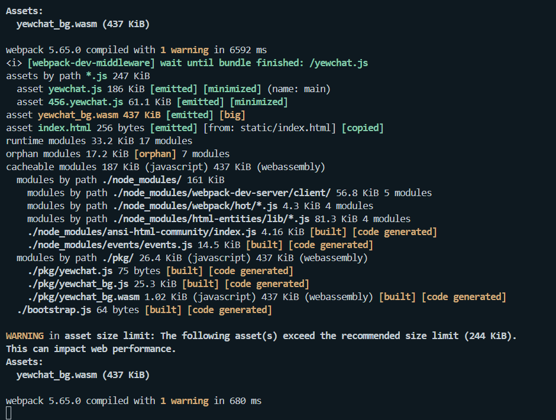
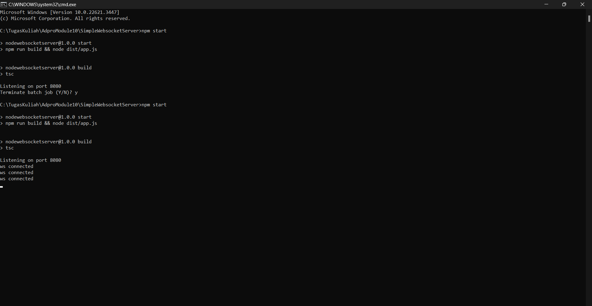
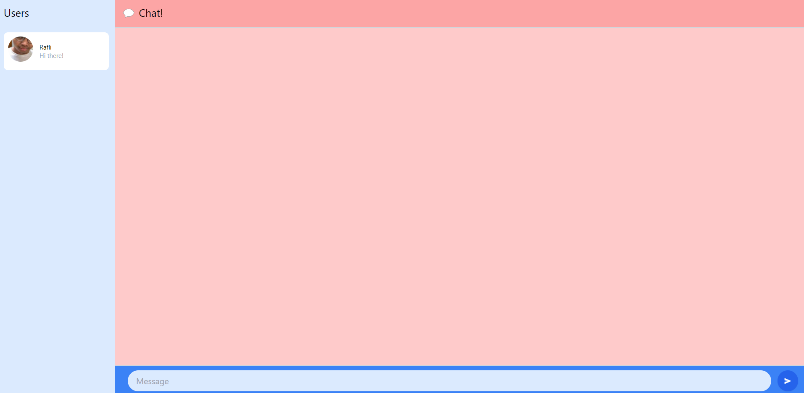

## 3.1. Original code

Lampiran bukti screenshot:  
  
  
  
  

## 3.2. Add some creativities to the webclient

Lampiran bukti screenshot:  
  
Pada commit ini, saya melakukan perubahan warna pada background chat. Selain itu, saya juga mengganti foto template user dengan foto lain.  